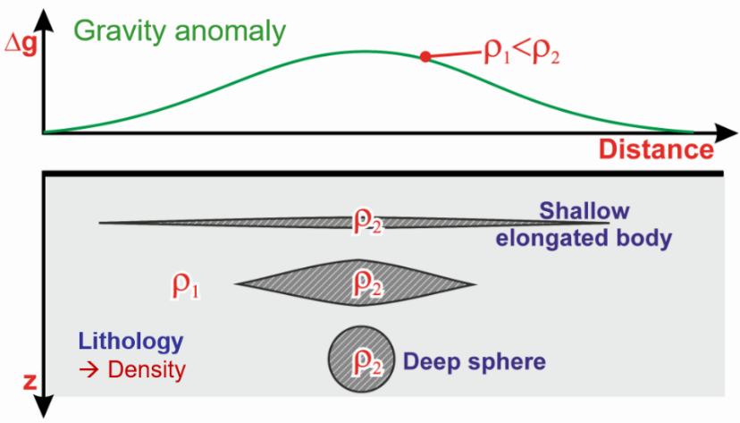
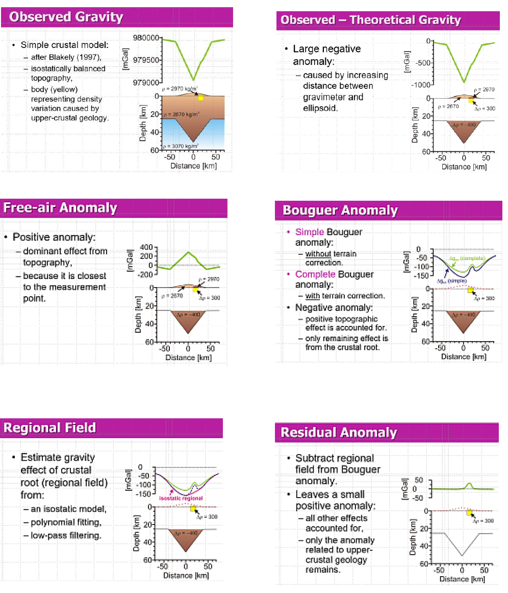

---
# Title, summary, and page position.
linktitle: 1. Introduction
summary: Introduction
weight: 1
icon: book
icon_pack: fas
toc: false

# Page metadata.
title: 1. Introduction
date: "2021-03-17T00:00:00Z"
type: book  # Do not modify.
---

**This tutorial describes how a user gets started with IGMAS+**

**IGMAS+** calculates both fields of the potential methods: the gravity field and the magnetic field. It is user friendly and allows very fast calculations.

In this tutorial we focus on the explanations with gravity field modelling. The calculation of the magnetic field of geological bodies is equivalent: one replaces the rock parameter "density" by the rock parameter "magnetic susceptibility" or, where it is necessary, by the "remanent magnetization" of rocks. All explanations are valid for modelling with both fields.

> [!INFO] Gravity anomalies
**Gravity anomalies** - i.e. deviations from the normal field or theoretical gravity field of the Earth, $$\Delta g  = g_{measured} - \gamma_{normal}$$

provide us with insights into the geological structure and related density distribution of a region.

For a specific gravity anomaly, or, more realistically expressed, for an ensemble of anomalies to be explained, however, an infinite number of density distributions can theoretically cause these anomalies.

*Non-uniqueness of gravity interpretations. Three differently shaped bodies with density $\rho_2$ are embedded in a material of lower density $\rho_1$. The gravity anomaly above the section corresponds to only one of these bodies and shows a central high due to the density difference given. Without any other independent information (constraints) it cannot be concluded, which of the $\rho_2$-bodies is responsible for the observed gravity anomaly.*

Note the ambiguity of all potential field observations! It is essential to the modelling philosophy of **IGMAS+** to overcome this ambiguity by means of gravity-independent observations (constraints). With this software package, *Free Air*, *Bouguer*- and *geoid anomalies* can be modelled (among others: [Götze and Lahmeyer, 1988](../../publication/goetze-1988), [Schmidt et al., 2011](../../publication/schmidt-2011), [Schmidt et al., 2020](../../publication/schmidt-2020)).

At the beginning of each modelling, the user should decide whether to work with **Bouguer** or **Free Air anomalies**:
- work with **Free Air anomalies** if no terrain and Bouguer slab corrections were calculated before and
- work with **Bouguer anomalies** if both corrections had been applied to measurements.

This is an important decision, because the model must be built accordingly.
**IGMAS+** does not calculate one or the other anomaly, but the static part (attraction) of the gravity field of an Earth model, a sedimentary basin, a cavity or a mountain range which are represented as an ensemble of three-dimensional closed density bodies.
For the following it will be agreed that the geophysical term "Free Air anomaly" is equivalent to the geodetic term "Disturbance".

> [!INFO] Free Air anomaly (disturbance in geodesy):
> $$FA = g_P - \gamma + \delta g_F$$

> [!INFO] Bouguer anomaly:
$$BA = FA - \delta g_B$$

with:
- $g_P$ -- observed/measured gravity value at station $P$
- $\gamma$ -- normal gravity at the ellipsoid
- $\delta g_F$ -- Free Air correction (normal gravity at station $P$)
- $\delta g_B$ -- Bouguer mass correction (gravity effect of masses between the station $P$ and the ellipsoid)

The cartoon in [Fig. 1.2](#figure-gravity_cartoon) illustrates the diverse processing steps which are necessary to calculate gravity anomalies.

*This cartoon visualises the various steps required to compute a geophysical anomaly and the resulting changes in the processed gravity field. The individual images are to be read from top left to bottom right. They are taken from a presentation by Ron Hackney & Hajo Götze (pers. comm.)*

Calculation of $\gamma$, $\delta g_F$ and $\delta g_B$ is not a part of **IGMAS+** modelling and must be performed in advance. $\delta g_F$ and $\delta g_B$ are called correction terms, sometimes also “reduction” terms.
The user should look more closely into these correction terms while using downloaded gravity fields from the [ICGEM website](http://icgem.gfz-potsdam.de).

**IGMAS+** allows users to fit measured gravity observations to 3D and 2D density models and interactively compare the calculated fields to the observed anomalies.
We mention "observed anomalies" and by this mean that comparative values of the gravity fields can originate from two different sources:
- Specific processed field measurements, or
- Global models like those available on the [ICGEM website](http://icgem.gfz-potsdam.de).

Please refer also to the notes in the [chapter 4.6](../4_fitting_gravity/#46-remarks-on-the-use-of-icgem-gravity-datasets).

To obtain an interactively optimised fit between calculated and observed anomalies, users can:
1. manually adjust a density configuration by changing the density values and the geometries of density bodies
2. automatically invert a gravity field for a density configuration.

In this workflow, gravity independent observations (such as geological maps, borehole information, seismic velocities and discontinuities, cross sections derived from other geological and geophysical interpretations, etc.) are integrated at two stages:
1. when defining the density configuration of an initial 3D model and
2. when interactively modifying the model while simultaneously visualising the independent constraints.

Common to all inverse approaches, the number of the "free" parameters&#160;(degrees of freedom) in the modelling process should be significantly reduced before the final forward field matching, respectively inverse density calculation. For example, the final modelling step may be limited to the adjustment of the thickness and the lateral extent of a model unit with the pre-defined density (variation). Fixing as many other parameters of the initial 3D density model as possible requires the input data of appropriate spatial coverage and (in the best case) "old familiar" uncertainties. On the other hand, the model should be kept simple, in other words, one should choose complexity just to be able to answer a properly defined scientific question.

> "A model which images any detail of the reality is as useful as a map of scale one to one."
> 
> \- Joan V. Robinson

Note also the different scales for the individual results of the gravity calculations.
This procedure must be done by the user before modelling.